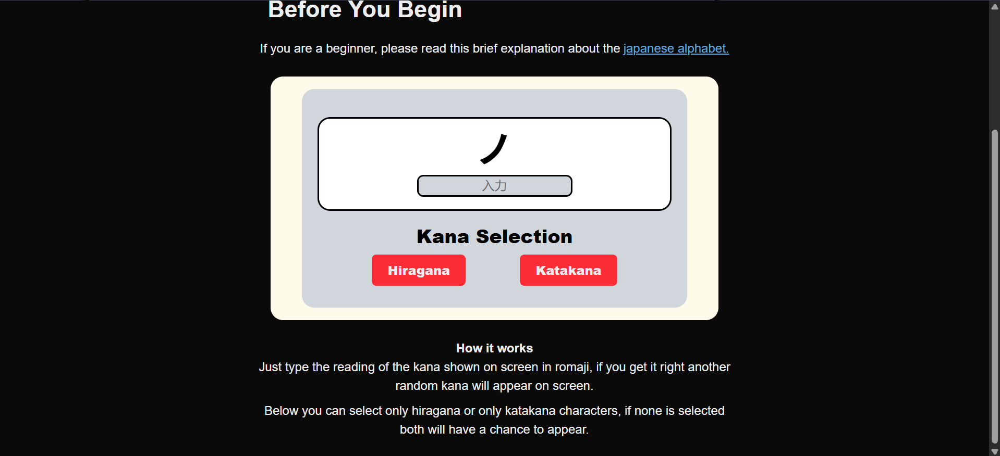

# Hello! I'm Estefano Campana

  
  

  
    

---

## About Me

Junior Software Developer graduated at SAIT with hands-on experience building and deploying full-stack applications using modern frameworks and cloud platforms. I enjoy creating user-focused applications and solving real-world problems through clean, scalable code.

---

## Tech Stack

### Languages

  
  
  
  

### Frameworks

  
  

### Databases

  
  

### Cloud & Tools

  
  
  
  

---

## Education

## Software Development Diploma – SAIT

**Sept 2024 – Apr 2026**

- Built and deployed full-stack apps using Next.js & React Native
- Designed relational databases (MySQL, MariaDB)
- Implemented cloud solutions with Azure & GCP
- Applied OOP and software design principles

---

## Featured Project

### 🎌 Japanese Learning Web App (KantanKanji)

  
  

**Description**  
A full-stack web application designed to help users learn Japanese through interactive exercises, vocabulary tracking, and real-time feedback.

**Key Features**

- Vocabulary trainer with spaced repetition (In Development)
- Hiragana and Katakana Drilling Practice
- Particle & Verb Conjugation Practice (About to Change)
- Responsive UI for desktop and mobile

**Tech Used**

- Frontend: Next.js
- Backend: Node.js
- Database: Firestore
- Deployed using Vercel (About To Change)

**📸 Preview**

**🔗 Links**

- 
- 

---

## Experience

### OMNI Customer Fulfillment Associate - Walmart

**May 2025 – Present**

- Developed strong problem-solving skills in fast-paced environments
- Maintained high accuracy under pressure
- Collaborated effectively within a team
- Built adaptability and efficiency mindset

---

## Goals

- Build useful and impactful applications
- Deepen knowledge in backend systems and cloud architecture
